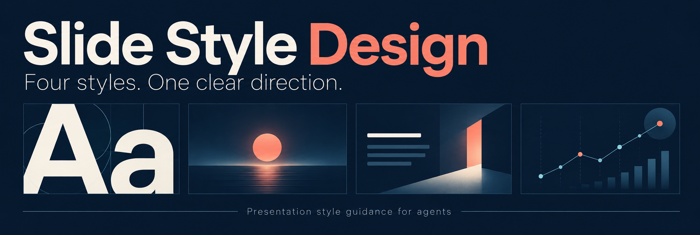

# Slide Style Design

[English](README.en.md) · **繁體中文（台灣）**



[](LICENSE)
[](skills/)
[](#輸出)
[](docs/first-release.md)

**為 ChatGPT 等 agent 提供四種簡報風格的判準與約束。**

面對既有素材，agent 可以依高橋流、賈伯斯流、忘形流或比爾蓋茲啟發的分析風格，說明應如何安排文字、焦點、圖文與證據的關係。每個樣式 skill 都是可獨立載入的指引；尚未選定風格時，可用 route skill 協助選擇。

本專案優先為 ChatGPT／GPT 設計，交付風格指引與約束。內容改寫、重組、投影片製作與匯出由使用它們的工具負責。

## 選擇入口

| Skill | 核心判準 | 使用時機 |
|---|---|---|
| [高橋流](skills/takahashi-style/SKILL.md) | 詞句透過相對尺度成為主要載體 | 想讓關鍵詞句主導注意力 |
| [賈伯斯流](skills/jobs-style/SKILL.md) | 所有元素共同支持一個明確焦點 | 展示產品、效益或同一項比較 |
| [忘形流](skills/wangxing-style/SKILL.md) | 精簡觀點與視覺有清楚、助於理解的關係 | 想讓圖文共同說明觀點 |
| [比爾蓋茲啟發的分析風格](skills/gates-style/SKILL.md) | 證據、數量或系統元件連到分析重點 | 解釋比較、測試結果或系統關係 |
| [風格 route](skills/presentation-style-route/SKILL.md) | 尊重指定風格，否則依已提供的脈絡選一個主要風格 | 尚未決定風格 |

「忘形流」指張忘形；`wangxing` 是本專案識別字。四種風格均為有來源支持的實務綜整，不是創作者認證、逐字規則或官方簡報公式。黑底、大字、黑白、幽默與高密度都不能單獨證明風格成立。

## 開始使用

### 本機 agent：透過 `npx skills add` 安裝

在要使用 skills 的專案目錄執行。需要 Node.js、npm 與 Git；本次測試的 `skills` CLI 1.7.0 要求 Node.js 22.20.0 以上。

Codex：

```sh
npx skills add https://github.com/CXPhoenix/slide-style-design/tree/main/skills \
  --agent codex --skill '*' --yes
```

Claude Code：

```sh
npx skills add https://github.com/CXPhoenix/slide-style-design/tree/main/skills \
  --agent claude-code --skill '*' --yes
```

這會在目前專案安裝五個產品 skills，Codex 放在 `.agents/skills/`，Claude Code 放在 `.claude/skills/`。指定 `skills/` 子目錄，可限定為產品內容；repo 根目錄也包含開發協作 skills，直接搜尋整個 repo 會一併列出它們。

只需要一種風格時，可指定名稱；例如安裝已發布的 `v0.1.0` 賈伯斯流：

```sh
npx skills add https://github.com/CXPhoenix/slide-style-design/tree/v0.1.0/skills \
  --agent codex --skill jobs-style --copy --yes
```

`main` 取得目前主分支內容；版本網址固定在指定 release。可用上表的 skill 名稱替換 `jobs-style`。若要使用 route，建議安裝全部五個，讓它能取得選定風格的定義。

已實測 Codex／Claude Code 的專案目錄安裝、完整檔案與參考連結，詳見[安裝驗證](docs/reviews/skills-cli-installation.md)。CLI 的其他安裝範圍與 agent 選項見[官方文件](https://github.com/vercel-labs/skills#install-a-skill)。這些指令安裝本機 agent 檔案，不會替 ChatGPT 網頁版或 Skills MCP 註冊 skills。

### ChatGPT／其他宿主：提供指引文件

1. 取得上表中所需的 `SKILL.md` 與它引用的 `references/`。已選好風格時，可直接使用樣式 skill。
2. 透過宿主支援的附件、指令或 skill 載入方式提供文件，讓它能按需要讀取參考內容。只輸入 skill 名稱不代表已安裝。
3. 提供既有素材、用途與要求。尚未選風格時，改用 route；每次選一個主要風格。

例如，提供 `jobs-style` 的定義與參考內容後，提出：

> 請依賈伯斯流提供風格指引與 YAML 約束。素材是 A、B、C、D 四款產品在同一條件下的電池續航比較；結果僅適用於此次測試。我要彩色，請保留比較條件。

skill 會說明如何讓多個產品共同服務同一比較，並保留必要限定。若調整破壞核心，會解釋衝突與相容建議；尚未接受的建議不會被套用。

## 輸出

Markdown 解釋原則、條件與例外，搭配預設 YAML；明確要求 JSON 時才切換。一次只提供一種結構化格式，欄位與規則識別字使用 English。

```yaml
style_id: jobs
core_rules:
  - rule_id: jobs.single_focus
    constraint: 所有展示與比較元素共同支持一個明確焦點，保留理解比較所需的條件。
adjustable_rules: []
```

以上是精簡的格式示例；實際約束依素材與完整定義而定。風格不會授權刪除必要條件，也沒有通用固定字數、字級、播放節奏或物件數公式。

## 驗證與界線

已保留文件契約檢查、代表性 ChatGPT「對話」試驗與失敗修正紀錄；[驗收說明](docs/first-release.md)區分實際試驗與沿用舊版本的適用推論。這些結果不代表全部模型、簡報工具或學習成效都已驗證。**Skills MCP 動態載入相容性尚未驗證。**

試驗紀錄以相關輸入、回覆與判讀供查核；公開副本已去除私人瀏覽器資訊。副本與原始證據的差異見[公開資料查核](docs/reviews/public-disclosure.md)。

## 參與專案

請先閱讀[貢獻指南](CONTRIBUTING.md)與[行為準則](CODE_OF_CONDUCT.md)。修改來源或風格規則時，請區分來源證據與專案解讀，並提供相容、衝突與必要限定的案例。

開發檢查（Python 3.11+）：

```sh
python3 -m pip install -r requirements-test.txt
python3 -B -m unittest discover -s tests -v
python3 scripts/verify-project.py
python3 scripts/verify-public-content.py
```

測試檢查產品結構、規則契約與證據連結；`verify-project.py` 檢查開發協作結構；`verify-public-content.py` 檢查工作目錄中的已知私人資訊模式，範圍不含 Git 歷史。它們不會執行 ChatGPT 或證明 Skills MCP 載入。產品位於 `skills/`；`.agents/skills/` 與 `.claude/skills/` 是開發協作工具。

## 授權

本專案與產品 skills 採 [MIT License](LICENSE)。第三方素材保留原授權與[聲明](THIRD_PARTY_NOTICES.md)。創作者與產品名稱用於來源識別，不表示合作或背書。
